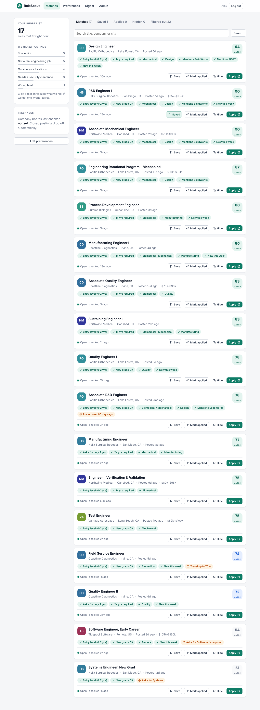

# RoleScout

Job search for early-career engineers that only shows roles that are **real, open, and actually at your level**.

RoleScout reads postings straight from company careers systems (Greenhouse, Lever, Ashby, Workday, SmartRecruiters), extracts what each posting *actually* requires (level, years, real engineering or not, clearance, field, pay), drops postings the moment they close, and gives each user a short list with the reasons every job was included or hidden.



## Run it on your laptop (5 minutes)

Needs Python 3.11+. Commands in this README have no inline comments, so every block can be pasted straight into a Mac terminal (zsh treats `#` in pasted lines as an error).

```bash
cd rolescout
python3 -m venv .venv && source .venv/bin/activate
pip install -e ".[dev]"
rolescout demo
rolescout serve
```

`demo` loads fictional companies and a demo login; `serve` starts the app at http://localhost:8000. Log in with `demo@rolescout.local` / `demo12345`. The demo user is an admin, so you also get `/admin`.

## Point it at real companies

```bash
rolescout seed
rolescout check-sources
rolescout run
```

`seed` loads the starter SoCal list in `rolescout/seeds/sources.yaml`, `check-sources` test-fetches each board so you can fix or delete the ones that fail, and `run` fetches and analyzes every posting.

Add any company by pasting its careers URL (in the admin page, or):

```bash
rolescout add-source https://jobs.lever.co/acme --company "Acme" --industry medical_devices
```

The starter list was written from memory in an environment that could not reach the job boards. **None of it is verified.** `check-sources` tells you which ones work.

## Model tiers

| Tier | Runs on | Default | Cost |
|---|---|---|---|
| Rules | every posting | always on | free |
| Bulk extraction | postings whose title could be engineering | `heuristic` (rules only) | `local` = free; Claude = per call |
| Verification | disagreements, low confidence, 5% QA sample | `none` | Claude Sonnet 5.5 |

Your local models with Ollama on a Mac (use `qwen2.5:7b-instruct` instead on a 16 GB machine):

```bash
brew install ollama
brew services start ollama
ollama pull qwen2.5:14b-instruct
rolescout eval --extractor local --model qwen2.5:14b-instruct
```

RoleScout detects Ollama and sets the context window on every request (8,192 tokens, change with `ROLESCOUT_LOCAL_LLM_NUM_CTX`), so Ollama needs no configuration. Before scoring anything it checks the server is running and the model is downloaded, and tells you the exact fix if not. LM Studio and other OpenAI-compatible servers work too: set `ROLESCOUT_LOCAL_LLM_BASE_URL=http://localhost:1234/v1`.

To use the local model for the real pipeline, put this in `.env`:

```
ROLESCOUT_EXTRACTOR=local
ROLESCOUT_EXTRACTOR_MODEL=qwen2.5:14b-instruct
```

Claude as verifier (needs `ANTHROPIC_API_KEY` or `ant auth login`; API usage is billed separately from a Claude.ai subscription):

```bash
export ROLESCOUT_VERIFIER=anthropic ROLESCOUT_VERIFIER_MODEL=claude-sonnet-5-5
```

Verifier calls use Claude's server-side refusal fallback (`fallbacks: "default"`), so a safety-classifier decline is re-run on Anthropic's recommended fallback model instead of failing the call.

Before trusting a model, measure it:

```bash
rolescout eval
rolescout eval --extractor local --model qwen2.5:14b-instruct
rolescout eval --extractor anthropic --model claude-haiku-4-5
```

The first line scores the rules alone, the second your local model, the third a Claude model. Model runs print one line per posting as they go.

Every model call is logged with tokens and dollars. `/admin` shows cost per job and verifier agreement rate.

## Commands

| Command | What it does |
|---|---|
| `rolescout serve` | Web app (add `ROLESCOUT_SCHEDULE_MINUTES=180` to refresh automatically) |
| `rolescout run [--with-digest]` | One full refresh. Put it in cron if you don't use the built-in scheduler |
| `rolescout ingest` / `extract` / `digest` | Individual pipeline steps |
| `rolescout probe URL` | Detect and test-fetch a careers URL without saving |
| `rolescout eval` | Score extraction against `rolescout/seeds/eval_jobs.yaml` |
| `rolescout create-user EMAIL --admin` | Make an admin |
| `rolescout stats` | Counts and model spend |

## Deploy

`docker compose up -d` with a `.env` (see `.env.example`). Set `ROLESCOUT_SECRET_KEY`, `ROLESCOUT_BASE_URL` (https), `ROLESCOUT_ADMIN_EMAILS`, and SMTP settings for real email. SQLite on a volume is fine for the first few thousand users; set `DATABASE_URL` to Postgres when you outgrow it.

## Docs

- [docs/BUSINESS.md](docs/BUSINESS.md): positioning, validation plan with kill criteria, pricing, unit economics
- [docs/LAUNCH.md](docs/LAUNCH.md): the 2-week validation test, with ready-to-post drafts
- [docs/ARCHITECTURE.md](docs/ARCHITECTURE.md): how the pipeline works and why
- [CLAUDE.md](CLAUDE.md): guide for AI coding sessions working in this repo
- [REVIEW.md](REVIEW.md): review checklist for the advanced-model code review pass

## Tests

```bash
python -m pytest -q
```

102 tests: connectors, liveness, model tiers (including the native Ollama path), matching, auth/CSRF, digests, and review regressions.
